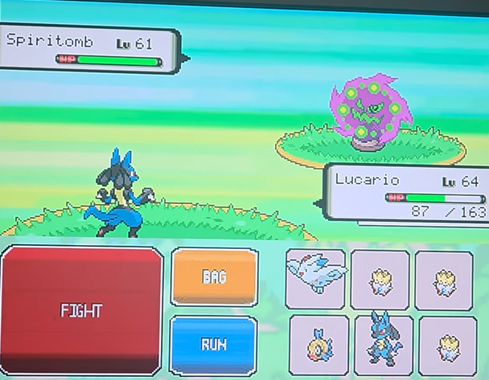
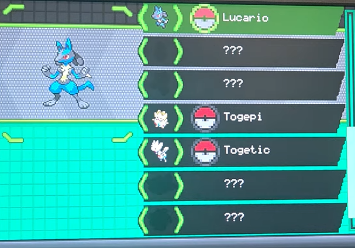

# Pokemon on C and NiosV

<table align="center">
  <tr>
    <td></td>
    <td></td>
  </tr>
</table>

  

<a href="https://www.youtube.com/watch?v=VjDEreAy7r8">Watch the full gameplay walkthrough</a>

A Pokemon RPG written from scratch in C, running bare metal on a NiosV soft processor on the DE1-SoC. No operating system, no game engine, or libraries. The graphics are raw RGB565 pixels pushed into a double buffered VGA framebuffer at a steady 20 fps, the controls come from a PS/2 keyboard driver, and the music and sound with audio interrupts. Final project for ECE243 (Computer Organization) at the University of Toronto.

Built with [AnRi1202 (Rikuto Ide)](https://github.com/AnRi1202): I did the game engine, rendering, and animations, he did the maps, audio, and PS/2 input.

## Features

A tile based overworld with six connected areas, turn based battles against wild Pokemon and trainers (including a Cynthia boss battle), the combat math (damage, STAB, type chart, accuracy, PP, status conditions), catching and fleeing, a party of six with switching, EXP, leveling, and evolution, plus a bag, item shop, PC storage box, Pokedex, and a naming screen driven by live keyboard text.

## Controls

Everything is on the PS/2 keyboard.

- **WASD** moves and navigates menus (hold two directions for diagonals).
- **Space** confirms and advances text.
- **Enter, Tab, Shift, Escape, arrows** handle menus, and you **type** to name things.

## Links

- **Gameplay walkthrough:** https://www.youtube.com/watch?v=VjDEreAy7r8
- **Technical report:** [PokemonProjectNiosV.pdf](PokemonProjectNiosV.pdf)

## Credits

Built for ECE243 at the University of Toronto. Pokemon is a trademark of Nintendo / Game Freak. Non commercial student project.

- [Bulbapedia](https://bulbapedia.bulbagarden.net/wiki/Damage) for the game mechanic formulas
- [PokemonDB](https://pokemondb.net/sprites) and [PokeSprite](https://msikma.github.io/pokesprite/index.html) for sprites
- [Pause menu UI](https://www.deviantart.com/audreyeyeyeye/art/Pokemon-Ignis-Cobalt-Final-Pause-Menu-UI-775269868) by audreyeyeyeye
- [The Spriters Resource](https://www.spriters-resource.com/ds_dsi/pokemonblackwhite/) for Black and White sprites
